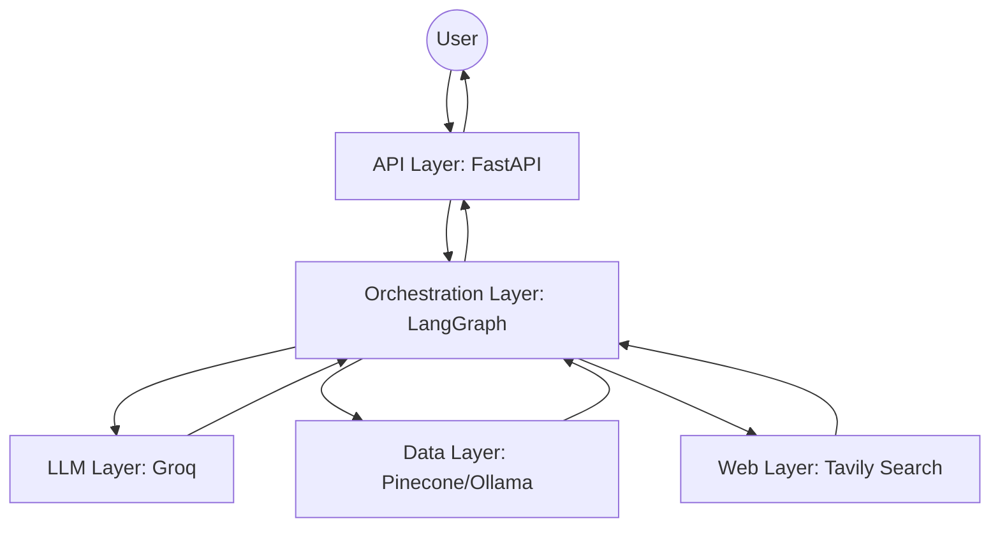
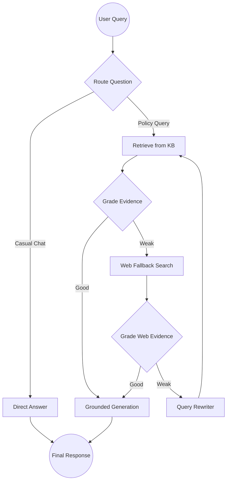

# 🏢 Enterprise HR Copilot: Agentic RAG System

[](https://www.python.org/)
[](https://fastapi.tiangolo.com/)
[](https://langchain-ai.github.io/langgraph/)
[](https://www.pinecone.io/)

## 🌟 Executive Summary
The **Enterprise HR Copilot** is a production-ready AI system designed to eliminate the operational bottlenecks of HR policy management. By implementing an **Agentic Retrieval-Augmented Generation (RAG)** workflow, it transforms static, fragmented HR documentation into a reliable, self-correcting digital assistant.

This project demonstrates the role of a **Forward Deployed Engineer (FDE)**: identifying a high-impact business problem (HR burnout and compliance risk) and architecting a full-stack AI solution that bridges the gap between raw data and executive-level reliability.

---

## 🎯 Business Impact

### The Challenge
In large-scale enterprises, HR knowledge is trapped in monolithic PDFs. This results in:
- **Operational Inefficiency**: HR teams spend 40% of their time answering repetitive policy questions.
- **Employee Friction**: High latency in getting accurate answers regarding leave, payroll, and benefits.
- **Compliance Risk**: Inconsistent interpretations of policy across different HR representatives.

### The Solution
A **Self-Correcting Copilot** that ensures:
- **Zero-Hallucination Goal**: Answers are strictly grounded in official documentation.
- **Autonomous Verification**: The system grades its own retrieved evidence and iterates until a high-confidence answer is found.
- **Seamless Fallbacks**: Intelligent routing between private company knowledge and verified external HR standards.

---

## 🏗 Detailed System Design

### Overview
The **Enterprise HR Copilot** implements a **self-correcting agentic loop** using a state-machine architecture to minimize hallucinations and maximize reliability. Unlike traditional RAG pipelines that follow a linear "Retrieve $\rightarrow$ Generate" path, this system can "think," "verify," and "correct" its own retrieval process.

### Engineering Goals
- **High Precision**: Ensure answers are strictly grounded in official documentation.
- **Reliability**: Implement self-grading mechanisms to detect and correct poor retrieval.
- **Fallback Capability**: Seamlessly transition from private knowledge bases to verified external sources when internal data is insufficient.
- **Transparency**: Provide a clear execution trace and citations for every response.
- **Enterprise Readiness**: Modular design with admin-controlled ingestion and secure API access.

### Technical Architecture

The system is decomposed into four primary layers:
1. **API Layer (FastAPI)**: Handles asynchronous request/response cycles and manages administrative tasks like document ingestion.
2. **Orchestration Layer (LangGraph)**: A state-machine that manages the agent's cognitive flow, including routing, grading, and query rewriting.
3. **Data Layer (Pinecone & Ollama)**: A serverless vector database for high-performance similarity search, powered by locally hosted embeddings.
4. **LLM Layer (Groq)**: High-throughput inference for reasoning, routing, and response generation.

#### High-Level Architecture Diagram


### Agentic Workflow (The State Machine)
The core of the system is a **LangGraph** state machine. This allows the agent to verify the quality of its information before responding to the user.

#### Workflow Stages:
1. **Intelligent Routing**: The `route_question` node analyzes the intent. Casual chat is routed to a `direct_answer` node, while policy queries are sent to the `retrieve_kb` node.
2. **KB Retrieval & Grading**:
   - The agent retrieves relevant chunks from **Pinecone**.
   - A **Grader** node evaluates the retrieved documents. If the evidence is `good`, it proceeds to generation. If `weak`, it triggers a fallback.
3. **Web Fallback & Grading**:
   - If internal KB is insufficient, the agent uses **Tavily Search** to find general HR best practices or public information.
   - The web evidence is also graded for relevance.
4. **Query Rewriting (Self-Correction)**:
   - If both KB and Web searches fail to provide a "good" grade, the agent invokes a **Query Rewriter**.
   - The rewriter optimizes the query for better retrieval and restarts the KB retrieval loop (up to a configured `max_retries`).
5. **Grounded Generation**:
   - The final generation node is strictly prompted to use *only* the provided context, explicitly mentioning the source (Private KB vs. Web).

#### Workflow Diagram


### Data Pipeline
#### Ingestion Flow:
`Document (.pdf, .docx, .md, .txt)` $\rightarrow$ `Text Extraction` $\rightarrow$ `Recursive Character Splitting` $\rightarrow$ `Ollama Embeddings` $\rightarrow$ `Pinecone Index`.

- **Chunking Strategy**: Uses `RecursiveCharacterTextSplitter` with a chunk size of 900 and overlap of 120. This ensures that semantic context is preserved across chunk boundaries.
- **Indexing**: Utilizes Pinecone Serverless with cosine similarity for efficient, scalable vector search.

---

## ⚖️ Technical Trade-offs & Decisions

| Decision | Chosen Approach | Alternative | Justification |
| :--- | :--- | :--- | :--- |
| **Orchestration** | LangGraph | Linear Chain | Linear chains cannot handle loops (like query rewriting) or complex conditional routing. |
| **Embeddings** | Ollama (Local) | OpenAI (Cloud) | Local embeddings ensure that the actual data vectors remain within the organization's infrastructure, reducing data privacy risks. |
| **Vector DB** | Pinecone Serverless | FAISS / Chroma | Serverless Pinecone provides better scalability and managed infrastructure compared to local vector stores. |
| **LLM Inference** | Groq | GPT-4 | Groq's LPU architecture provides near-instant inference, which is critical for a multi-step agentic loop that may call the LLM 3-5 times per query. |

---

## 🛡️ Security & Governance
- **Admin Authentication**: The `/ingest` endpoint is protected by an `X-Admin-Key` header, preventing unauthorized modification of the knowledge base.
- **Audit Logging**: Every query, the source used, and the agent's execution trace are logged to an audit database (`audit.db`) for compliance and performance monitoring.
- **Strict Prompting**: System prompts are engineered to prevent the LLM from inventing policies, forcing a "I don't know" response when evidence is missing.

---

## 📂 Project Structure
```text
Enterprise-HR-RAG/
├── app/
│   ├── api/            # Asynchronous FastAPI routes
│   ├── core/           # Enterprise config & logging
│   ├── rag/            # Agentic Logic (LangGraph, Pinecone, State)
│   └── services/       # Business logic (Ingestion, Auditing)
├── data/               # Sample Knowledge Base & Audit DB
├── static/             # Frontend assets (CSS/JS)
├── templates/          # HTML templates
├── Dockerfile          # Production containerization
└── ingest_sample_kb.py # Vector DB population utility
```

---

## ⚙️ Setup & Installation

### Prerequisites
- Python 3.10+
- Ollama (for local embeddings)
- API Keys: **Groq**, **Pinecone**, **Tavily**

### Quick Start
1. **Clone & Install**
   ```bash
   git clone https://github.com/your-username/enterprise-hr-rag.git
   cd enterprise-hr-rag
   pip install -r requirements.txt
   ```

2. **Configure Environment**
   Create a `.env` file:
   ```env
   GROQ_API_KEY=your_groq_key
   PINECONE_API_KEY=your_pinecone_key
   TAVILY_API_KEY=your_tavily_key
   OLLAMA_BASE_URL=http://localhost:11434
   ```

3. **Initialize Knowledge Base**
   ```bash
   python ingest_sample_kb.py
   ```

4. **Launch Application**
   ```bash
   python run.py
   ```

---

## 🔌 API Reference
| Method | Endpoint | Description | Access |
| :--- | :--- | :--- | :--- |
| `GET` | `/` | HR Copilot User Interface | Public |
| `POST` | `/api/chat` | Submit question to Agentic Workflow | Public |
| `POST` | `/api/ingest` | Securely index new HR documents | Admin (`X-Admin-Key`) |
| `GET` | `/api/health` | Service health check | Public |

---

## 📜 License
This project is licensed under the terms specified in the `LICENSE` file.
