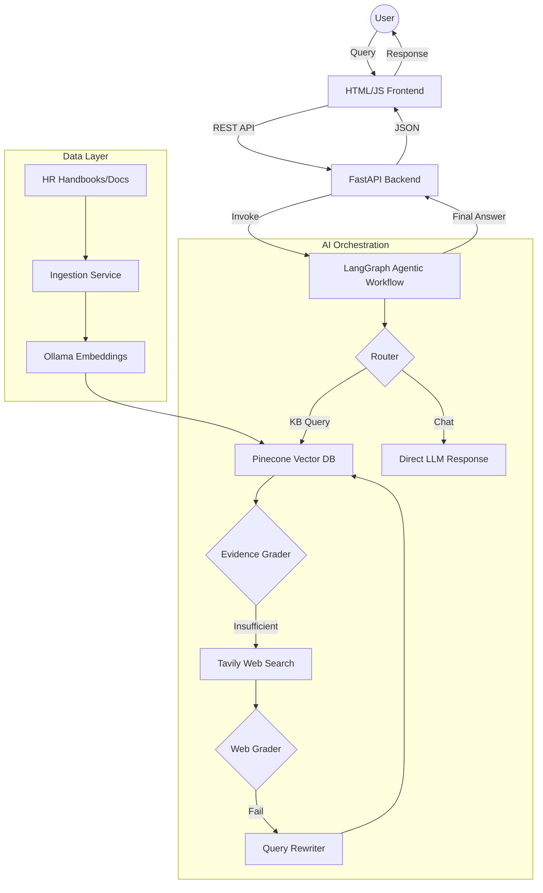
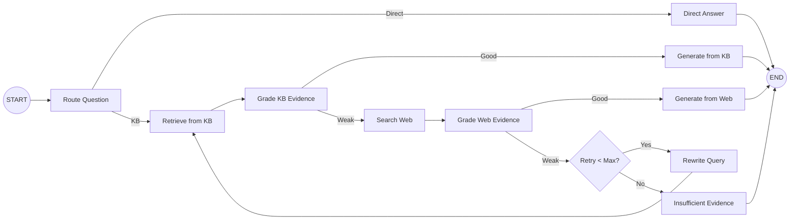

# 🏢 Enterprise HR Copilot: Agentic RAG System

[](https://www.python.org/)
[](https://fastapi.tiangolo.com/)
[](https://langchain-ai.github.io/langgraph/)
[](https://www.pinecone.io/)

An enterprise-grade HR policy and employee support assistant utilizing an **Agentic Retrieval-Augmented Generation (RAG)** workflow. This system transforms static HR handbooks into an interactive, grounded, and self-correcting copilot.

---

## 🎯 Business Case

### ❌ The Problem
In large organizations, HR policies are often buried in massive PDFs and handbooks. This leads to:
- **Employee Frustration**: Employees spend hours searching for answers on leave policies, payroll, or benefits.
- **HR Burnout**: HR teams are overwhelmed by repetitive, low-complexity queries.
- **Compliance Risk**: Inconsistent answers provided by different HR staff can lead to policy violations.

### ✅ The Goal
To implement a **Self-Correcting HR Copilot** that:
- Provides instant, grounded answers from official company documents.
- Maintains high precision by grading its own retrieved evidence.
- Falls back to verified external sources when internal knowledge is insufficient.
- Ensures transparency through clear source citations.

---

## 🚀 Why This is an FDE (Full-stack Data Engineering) Project

This project isn't just a wrapper around an LLM; it is a complete engineering pipeline combining multiple domains:

- **Frontend Engineering**: A clean, responsive UI for employee interaction.
- **Backend Engineering**: A scalable FastAPI architecture managing asynchronous AI workflows.
- **Data Engineering**: A complete RAG pipeline including document ingestion, chunking, and high-performance vector indexing with **Pinecone**.
- **AI Engineering**: Implementation of a **state-machine-based agent** using **LangGraph**, featuring query rewriting, evidence grading, and multi-source routing.

---

## 🛠 System Architecture

The architecture follows a modular approach to decouple the AI orchestration from the API and data layers.



---

## 🧠 Agentic RAG Workflow

Unlike standard RAG, which simply retrieves and generates, this system uses an **Agentic Loop** to ensure accuracy.



---

## 📂 Project Structure

```text
Enterprise-HR-RAG/
├── app/
│   ├── api/            # FastAPI routes and endpoints
│   ├── core/           # Configuration, logging, and settings
│   ├── rag/            # Core AI Logic
│   │   ├── workflow.py # LangGraph state machine definition
│   │   ├── state.py    # Agent state and Pydantic models
│   │   └── vectorestore.py # Pinecone & Embedding integration
│   └── services/       # Business logic (Ingestion, Auditing)
├── data/               # Local storage & sample KB
├── static/             # CSS and Frontend JS
├── templates/          # HTML templates
├── Dockerfile          # Containerization
├── ingest_sample_kb.py # Utility to populate Vector DB
└── requirements.txt    # Project dependencies
```

---

## ⚙️ Setup & Installation

### Prerequisites
- Python 3.10+
- Ollama (for local embeddings)
- API Keys: **Groq**, **Pinecone**, **Tavily**

### Installation
1. **Clone the repo**
   ```bash
   git clone https://github.com/your-username/enterprise-hr-rag.git
   cd enterprise-hr-rag
   ```

2. **Install dependencies**
   ```bash
   pip install -r requirements.txt
   ```

3. **Configure Environment**
   Create a `.env` file (or update `app/core/config.py`):
   ```env
   GROQ_API_KEY=your_groq_key
   PINECONE_API_KEY=your_pinecone_key
   TAVILY_API_KEY=your_tavily_key
   OLLAMA_BASE_URL=http://localhost:11434
   ```

4. **Ingest Sample Data**
   ```bash
   python ingest_sample_kb.py
   ```

5. **Run the Application**
   ```bash
   python run.py
   ```

---

## 🔌 API Endpoints

| Method | Endpoint | Description |
| :--- | :--- | :--- |
| `GET` | `/` | Serves the HR Copilot UI |
| `POST` | `/ask` | Submit a question to the Agentic RAG workflow |
| `POST` | `/ingest` | Upload and process new HR documents |

---

## 📜 License
This project is licensed under the terms specified in the `LICENSE` file.
